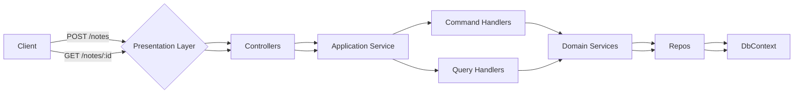
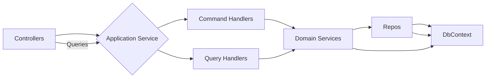
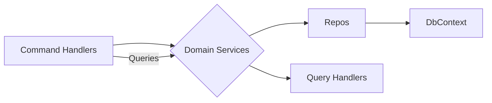
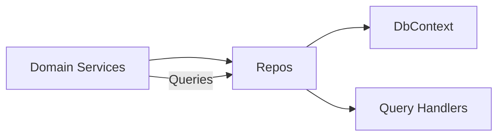
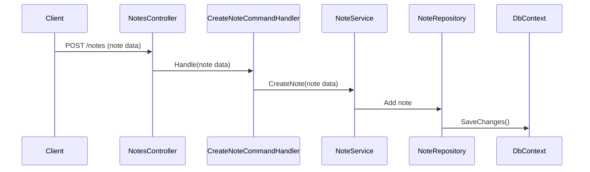
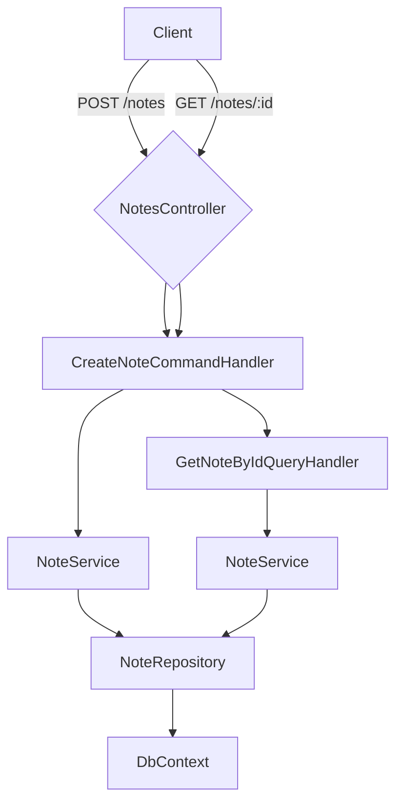

# System Overview

JodWai Note is a note-taking application built using ASP.NET Core Web API. The system allows users to create, read, update, and delete notes while organizing them with tags and linking related notes together.

## Architectural Style

The architecture follows the Clean Architecture pattern, which separates the application into distinct layers:

1. **Presentation Layer (JodWai.Api):** Handles HTTP requests and responses.
2. **Application Layer (JodWai.App):** Orchestrates business workflows, including command/query handling.
3. **Domain Layer (JodWai.Dom):** Contains core business logic, entities, value objects, and domain services.
4. **Infrastructure Layer (JodWai.Infra):** Manages data persistence and external services.

## Component Breakdown

### Domain Layer
- **Entities:**
  - `Note`
  - `Tag`

- **Value Objects:**
  - `NoteId`
  - `NoteTitle`
  - `NoteContent`
  - `Tag`
  - `NoteLink`

- **Aggregates:**
  - `Note`

### Application Layer
- **Commands:**
  - `CreateNoteCommand`
  - `UpdateNoteCommand`
  - `DeleteNoteCommand`
  - `CreateTagCommand`
  - `AddNoteToTagCommand`
  - `RemoveNoteFromTagCommand`

- **Queries:**
  - `GetNoteByIdQuery`
  - `GetAllNotesQuery`
  - `SearchNotesByTitleQuery`
  - `GetTagsForNoteQuery`

### Infrastructure Layer
- **Repositories:**
  - `INoteRepository`
  - `ITagRepository`

- **DbContext:**
  - `AppDbContext`

## Layer Breakdown

### Presentation Layer (JodWai.Api)
The presentation layer is responsible for handling HTTP requests and responses. It exposes REST endpoints to interact with the application.

### Application Layer (JodWai.App)
The application layer orchestrates business workflows, including command/query handling.

### Domain Layer (JodWai.Dom)
The domain layer contains core business logic, entities, value objects, and domain services.

### Infrastructure Layer (JodWai.Infra)
The infrastructure layer manages data persistence and external services.

## Request Lifecycle

1. **Create Note:**
   - Client sends a `POST` request to `/notes`.
   - The `NotesController` receives the request and invokes the `CreateNoteCommandHandler`.
   - The handler orchestrates the creation of a new note by invoking domain services.
   - The domain service saves the note using the repository.

2. **Get Note:**
   - Client sends a `GET` request to `/notes/:id`.
   - The `NotesController` receives the request and invokes the `GetNoteByIdQueryHandler`.
   - The handler retrieves the note from the repository.
   - The controller returns the retrieved note as a response.

## Sequence Diagram

## Component Diagram

## External Dependencies

- **PostgreSQL:** Used for data persistence.
- **xUnit + Moq:** For unit testing.

## Architectural Decisions

1. **Clean Architecture Pattern:** Adopted to ensure separation of concerns and maintainability.
2. **Command/Query Separation:** MediatR used to handle commands and queries, maintaining a clean separation between business logic and external services.

## Constraints and Tradeoffs

- **No direct database access in domain layer:** Ensures loose coupling but adds complexity in managing transactions.
- **Complexity in handling note-to-note relationships:** Additional logic required for linking related notes.