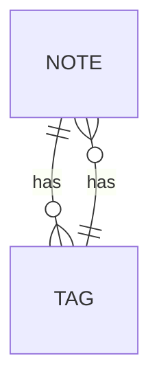

# Domain Overview

The domain layer of the JodWai Note application is responsible for encapsulating core business logic, entities, value objects, and domain services. This document provides a detailed mapping of these components.

## Entities

### Note
- **Identity:** NoteId (Guid)
- **Key Attributes:**
  - Title (string)
  - Content (string)
  - CreatedAt (DateTime)
  - UpdatedAt (DateTime)
- **Key Behaviors:**
  - CreateNote()
  - UpdateNote()
  - DeleteNote()
- **Invariants:**
  - Title must not be empty.
  - Content must not be null.

### Tag
- **Identity:** TagId (Guid)
- **Key Attributes:**
  - Name (string)
  - CreatedAt (DateTime)
  - UpdatedAt (DateTime)
- **Key Behaviors:**
  - CreateTag()
  - UpdateTag()
  - DeleteTag()

## Value Objects

### NoteId
- **Fields:** Guid
- **Validation Rules:** Must be a valid GUID.
- **Immutability Rules:** Immutable.

### NoteTitle
- **Fields:** string
- **Validation Rules:** Length > 0, No null or whitespace.
- **Immutability Rules:** Immutable.

### NoteContent
- **Fields:** string
- **Validation Rules:** Not null.
- **Immutability Rules:** Immutable.

### TagId
- **Fields:** Guid
- **Validation Rules:** Must be a valid GUID.
- **Immutability Rules:** Immutable.

### NoteLink
- **Fields:** Guid
- **Validation Rules:** Must be a valid GUID.
- **Immutability Rules:** Immutable.

## Aggregates

### Note (Aggregate Root)
- **Owned Objects:**
  - Tags (List<NoteToTag>)
- **Consistency Boundary:** Ensures note and its tags are consistent.

### Tag
- **Owned Objects:**
  - Notes (List<NoteToTag>)
- **Consistency Boundary:** Ensures tag and its notes are consistent.

## Domain Services

### NoteService
- **Responsibilities:**
  - Validates note data before creating, updating, or deleting.
  - Manages relationships between notes and tags.

### TagService
- **Responsibilities:**
  - Validates tag data before creating, updating, or deleting.
  - Manages relationships between tags and notes.

## Business Rules

1. A note must have a non-empty title.
2. A note cannot have null content.
3. Tags must be unique within a note.
4. Each note-to-tag relationship is unique.

## Relationships Diagram

## Ubiquitous Language

- **Note:** Represents a single note with title, content, and associated tags.
- **Tag:** Represents a tag used to categorize notes.
- **NoteToTag:** Represents the relationship between a note and a tag.